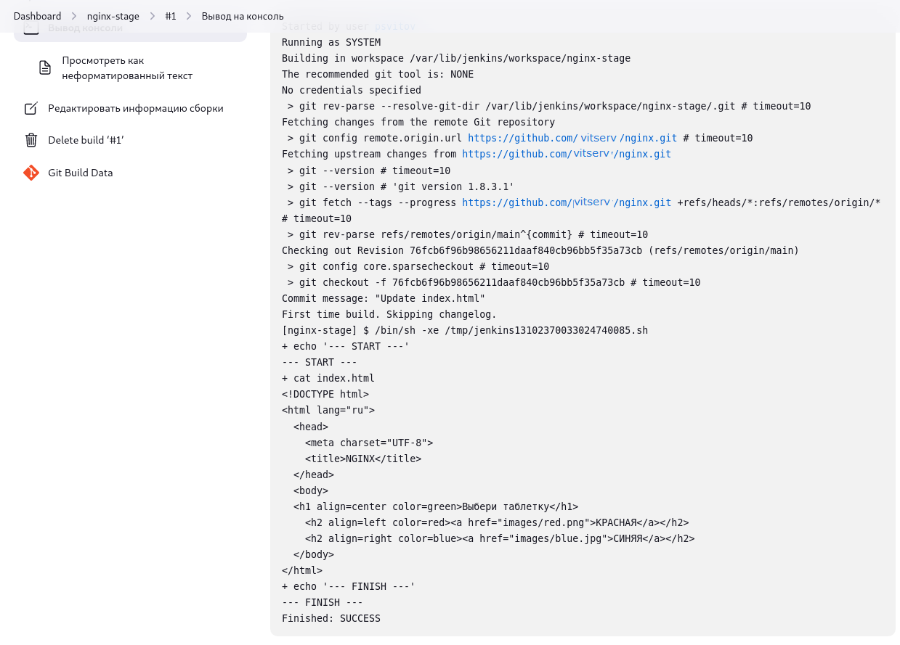

Ход выполнения 

- подключаемся к jenkins по внешнему адресу http://<ip-адрес>:8080
- предварительно производим настройки `Jenkins`
- создаем задачу для создания docker-образа на основе git-репозитория и файлов из папки [Dockerfile](https://github.com/psvitov/devops-netology/tree/main/Diplom/final/Dockerfile), поместив данные файлы в отдельный git-репозиторий и настроив webhook на сервис Jenkins
- в процессе изменения git-репозитория, настариваем использование тегов для деплоя изменений в под кластера `Kubernetes`


### Установка и настройка CI/CD

<details>
   <summary><b>ЗАДАНИЕ</b></summary>

Осталось настроить ci/cd систему для автоматической сборки docker image и деплоя приложения при изменении кода.

Цель:

1. Автоматическая сборка docker образа при коммите в репозиторий с тестовым приложением.
2. Автоматический деплой нового docker образа.

Можно использовать [teamcity](https://www.jetbrains.com/ru-ru/teamcity/), [jenkins](https://www.jenkins.io/) либо [gitlab ci](https://about.gitlab.com/stages-devops-lifecycle/continuous-integration/)

Ожидаемый результат:

1. Интерфейс ci/cd сервиса доступен по http.
2. При любом коммите в репозиторие с тестовым приложением происходит сборка и отправка в регистр Docker образа.
3. При создании тега (например, v1.0.0) происходит сборка и отправка с соответствующим label в регистр, а также деплой соответствующего Docker образа в кластер Kubernetes.

</details>   

---
### Решение
---

1. Для автоматической сборки docker image и деплоя приложения при изменении кода развернем в ЯО сервер и агент `Jenkins`.

2. Сформируем манифест `Terraform` для создания инфраструктуры и воспользуемся манифестом `Ansible` для развертывания самого сервиса `Jenkins`

Чтобы предварительно настроить и сервер и агент, добавим их в инвентори-файл `inventory.ini` через ранее созданный скрипт `terraform.sh`

Ссылка на измененный скрипт: [terraform.sh](https://github.com/Vitalya-Mozgovoy/Diplom/tree/master/diplom/jenkins/jenkins/terraform.sh)

Ссылка на основные файлы манифестов для разворачивания: [`Jenkins`](https://github.com/Vitalya-Mozgovoy/Diplom/tree/master/diplom/jenkins/jenkins)

3. После создания инфраструктуры настраиваем сам сервер `Jenkins`  и настраиваем новый `Pipeline` для сборки и отправки в регистр Docker образа на основе репозитория с тестовым приложением
---

Так как нам необходимо, чтобы при каждом коммите происходила сборка образа, то указываем созданный на 2-м этапе репозиторий в пунктах `GitHub project` и  Управление конфигурацией`Git`, проверяем основную ветку репозитория, а так же отмечаем пункт `GitHub hook trigger for GITScm polling`

Шаг сборки добавляем `Выполнить команду shell` и добавим тестовый скрипт:
---

---
Для того, чтобы происходило отслеживание в репозитории, необходимо настроить `webhook` в самом репозитории:

4. Первую сборку необходимо провести вручную. Проверяем тестовый скрипт:

---

---

5. Изменим скрипт: пропишем в нем создание Docker-образа из Dockerfile, а так же отправим Docker-образ на `DockerHub`:

---

---

Результат выполнения: [Jenkins Job 1](https://github.com/Vitalya-Mozgovoy/Diplom/blob/master/diplom/jenkins/jenkins/jenkins-job.txt)

6. Проверим запись образа в DockerHub:

---

---

7. Внесем изменения в файл `index.html` для проверки автоматической сборки:

---

---
Происходит автоматический запуск сборки и размещения образа в `DockerHub`

Результат выполнения: [Jenkins Job 2](https://github.com/Vitalya-Mozgovoy/Diplom/blob/master/diplom/jenkins/jenkins/jenkins-job2.txt)

8. Для автоматического деплоя нового docker образа на основе тега доработаем конфигурационныей файлы `Qbec`.

Определим внешнюю переменную `image_tag` в файле `qbec.yaml`:

```
## qbec.yaml

apiVersion: qbec.io/v1alpha1
kind: App
metadata:
  name: qbec-stage
spec:
  environments:
    stage:
      defaultNamespace: qbec
      server: https://127.0.0.1:6443
  vars:
    external:
      - name: image_tag
        default: latest
```

Измененный [qbec.yaml](https://github.com/Vitalya-Mozgovoy/Diplom/blob/master/diplom/jenkins/jenkins/qbec.yaml)


Добавим в конфигурацию `stage.jsonnet` внешнюю переменную для определения тега :

```
## stage.jsonnet

local prefix = 'stage';
local imageTag = std.extVar('image_tag');

[
  {
    apiVersion: 'apps/v1',
    kind: 'Deployment',
    metadata: {
      name: 'diplom-' + prefix,
    },
    spec: {
      replicas: 1,
      selector: {
        matchLabels: {
          app: 'app-' + prefix,
          tier: prefix
        },
      },
      template: {
        metadata: {
          labels: {
            app: 'app-' + prefix,
            tier: prefix
          },
	},
	spec: {
          containers: [
            {
              name: 'front-' + prefix,
              image: 'docker.io/vitserv/nginx-stage:' + imageTag,
              imagePullPolicy: 'Always',
            },
          ],
	},
      },
    },
  },
]
```

Измененный [stage.jsonnet](https://github.com/Vitalya-Mozgovoy/Diplom/blob/master/diplom/jenkins/jenkins/stage.jsonnet)

9. В `Jenkins` к нашему основному заданию добавим создание тегов и задачу тестовой проверки:

---

---

Так же добавим, при положительном тестировании, а именно при необходимом нам теге, деплой приложения в кластер `Kubernetes`:

---

---

10. Проведем тестирование с условием, что при теге `v0.1.12` произойдет деплой приложения в кластер `Kubernetes`:

Ссылка на [10-ю сборку](https://github.com/Vitalya-Mozgovoy/Diplom/blob/master/diplom/jenkins/jenkins/build10.txt)

11-я и 12-я сборка пройдет в автоматическом режиме - дважды изменим файл `index.html` в репозитории:

---

---

Ссылка на [12-ю сборку](https://github.com/Vitalya-Mozgovoy/Diplom/blob/master/diplom/jenkins/jenkins/jenkins-job2.txt)

11. Проверим под в кластере `Kubernetes` и веб-страницу:

---

---

---

---

# Итоги:

В итоге все необходимые файлы для развертывания инфраструктуры и работы с ней собраны в отдельной папке [`Final`](https://github.com/psvitov/devops-netology/tree/main/Diplom/final).

Структура папки:

```
.
├── Dockerfile
│   ├── Dockerfile
│   ├── images
│   │   ├── blue.jpg
│   │   └── red.png
│   ├── index.html
│   └── README.md
├── jenkins
│   ├── files
│   │   ├── CentOS-Base.repo
│   │   └── pg_hba.conf
│   ├── inventory
│   │   └── cicd
│   │       ├── group_vars
│   │       │   └── jenkins.yml
│   │       └── hosts.yml
│   └── site.yml
├── monitoring
│   ├── grafana-networkPolicy.yaml
│   └── grafana-service.yaml
├── qbec
│   ├── qbec-nodeport.yaml
│   ├── qbec.yaml
│   └── stage.jsonnet
├── README.md
└── terraform
    ├── ansible
    │   └── README.md
    ├── ansible.cfg
    ├── ansible.tf
    ├── backend.tf
    ├── inventory.tf
    ├── jenkinsagent.tf
    ├── jenkinsmaster.tf
    ├── jenkins.tf
    ├── jenkins.txt
    ├── k8s.tf
    ├── kuberspray.yml
    ├── main.tf
    ├── masters.tf
    ├── meta.txt
    ├── network.tf
    ├── nodes.tf
    ├── terraform.sh
    └── variables.tf
```