# Дипломный практикум в Yandex.Cloud 
  * [Цели:](#цели)
  * [Этапы выполнения:](#этапы-выполнения)
     * [Создание облачной инфраструктуры](#создание-облачной-инфраструктуры)
     * [Создание Kubernetes кластера](#создание-kubernetes-кластера)
     * [Создание тестового приложения](#создание-тестового-приложения)
     * [Подготовка cистемы мониторинга и деплой приложения](#подготовка-cистемы-мониторинга-и-деплой-приложения)
     * [Установка и настройка CI/CD](#установка-и-настройка-cicd)
  * [Что необходимо для сдачи задания?](#что-необходимо-для-сдачи-задания)
  * [Как правильно задавать вопросы дипломному руководителю?](#как-правильно-задавать-вопросы-дипломному-руководителю)

---
## Цели:

1. Подготовить облачную инфраструктуру на базе облачного провайдера Яндекс.Облако.
2. Запустить и сконфигурировать Kubernetes кластер.
3. Установить и настроить систему мониторинга.
4. Настроить и автоматизировать сборку тестового приложения с использованием Docker-контейнеров.
5. Настроить CI для автоматической сборки и тестирования.
6. Настроить CD для автоматического развёртывания приложения.

---
## Этапы выполнения:


### Создание облачной инфраструктуры

Для начала необходимо подготовить облачную инфраструктуру в ЯО при помощи [Terraform](https://www.terraform.io/).

Особенности выполнения:

- Бюджет купона ограничен, что следует иметь в виду при проектировании инфраструктуры и использовании ресурсов;
- Следует использовать последнюю стабильную версию [Terraform](https://www.terraform.io/).

Предварительная подготовка к установке и запуску Kubernetes кластера.

1. Создайте сервисный аккаунт, который будет в дальнейшем использоваться Terraform для работы с инфраструктурой с необходимыми и достаточными правами. Не стоит использовать права суперпользователя
2. Подготовьте [backend](https://www.terraform.io/docs/language/settings/backends/index.html) для Terraform:  
   а. Рекомендуемый вариант: [Terraform Cloud](https://app.terraform.io/)  
   б. Альтернативный вариант: S3 bucket в созданном ЯО аккаунте
3. Настройте [workspaces](https://www.terraform.io/docs/language/state/workspaces.html)  
   а. Рекомендуемый вариант: создайте два workspace: *stage* и *prod*. В случае выбора этого варианта все последующие шаги должны учитывать факт существования нескольких workspace.  
   б. Альтернативный вариант: используйте один workspace, назвав его *stage*. Пожалуйста, не используйте workspace, создаваемый Terraform-ом по-умолчанию (*default*).
4. Создайте VPC с подсетями в разных зонах доступности.
5. Убедитесь, что теперь вы можете выполнить команды `terraform destroy` и `terraform apply` без дополнительных ручных действий.
6. В случае использования [Terraform Cloud](https://app.terraform.io/) в качестве [backend](https://www.terraform.io/docs/language/settings/backends/index.html) убедитесь, что применение изменений успешно проходит, используя web-интерфейс Terraform cloud.

Ожидаемые результаты:

1. Terraform сконфигурирован и создание инфраструктуры посредством Terraform возможно без дополнительных ручных действий.
2. Полученная конфигурация инфраструктуры является предварительной, поэтому в ходе дальнейшего выполнения задания возможны изменения.

### Решение

1. Создал сервисный аккаунт, который будет в дальнейшем использоваться Terraform для работы с инфраструктурой с необходимыми и достаточными правами.

2. Подготовил backend для Terraform: Выбрал альтернативный вариант: S3 bucket в созданном ЯО

   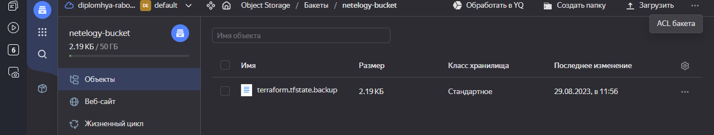
3. Настроил workspaces. Выбрал рекомендуемый вариант: создал два workspace: stage и prod.

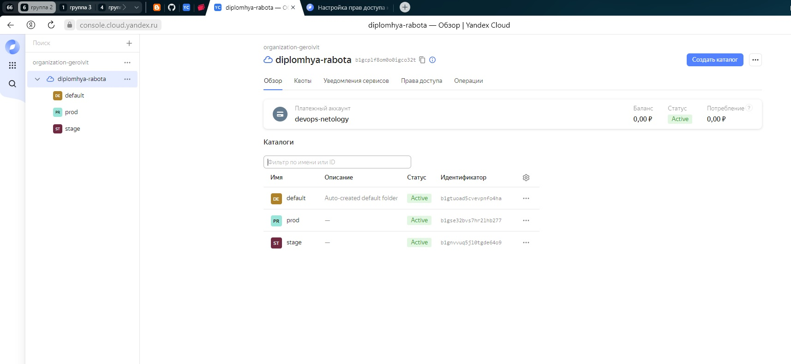

4. Создал VPC с подсетями в разных зонах доступности.

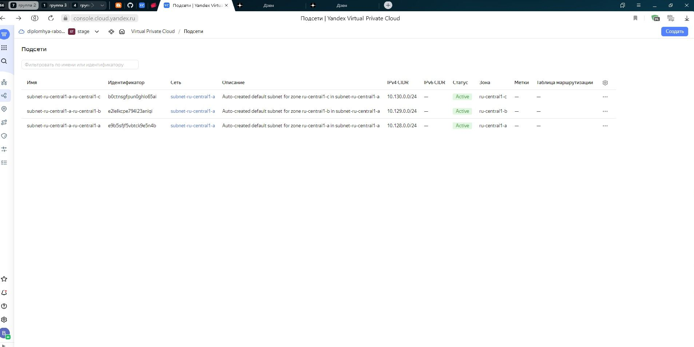

5. Убедился, что теперь могу выполнить команды terraform destroy и terraform apply без дополнительных ручных действий
(Повторный прогон команды terraform apply)


```commandline
(venv) root@server1:~/terraform/diploma/src/terraform# terraform apply -auto-approve
yandex_vpc_network.subnet-zones: Refreshing state... [id=enpnba6dc7hcdd1u14n0]
yandex_vpc_subnet.subnet-zones[1]: Refreshing state... [id=e2l8htduonuppss834o0]
yandex_vpc_subnet.subnet-zones[2]: Refreshing state... [id=b0c36heim7m1r337q4lc]
yandex_vpc_subnet.subnet-zones[0]: Refreshing state... [id=e9bpp3vt4laobgsgofap]
yandex_compute_instance.cluster-k8s[1]: Refreshing state... [id=epdajjgqkhqbb8bq1ukm]
yandex_compute_instance.cluster-k8s[2]: Refreshing state... [id=ef3r58s56f46jrnurndc]
yandex_compute_instance.cluster-k8s[0]: Refreshing state... [id=fhmhpn0nrnnlok1ocld4]

Changes to Outputs:
  ~ external_ip_address_nodes = {
      ~ node-0 = "158.160.43.46" -> "158.160.52.149"
      ~ node-1 = "51.250.31.139" -> "158.160.68.200"
      ~ node-2 = "51.250.45.59" -> "84.201.169.219"
    }

You can apply this plan to save these new output values to the Terraform state, without changing any real infrastructure.

Apply complete! Resources: 0 added, 0 changed, 0 destroyed.

Outputs:

external_ip_address_nodes = {
  "node-0" = "158.160.116.38"
  "node-1" = "84.201.177.171"
  "node-2" = "51.250.41.217"
}
internal_ip_address_nodes = {
  "node-0" = "10.10.1.25"
  "node-1" = "10.10.2.5"
  "node-2" = "10.10.3.18"
}
```

Получил ожидаемые результаты:

1. Terraform сконфигурирован и создание инфраструктуры посредством Terraform возможно без дополнительных ручных действий.

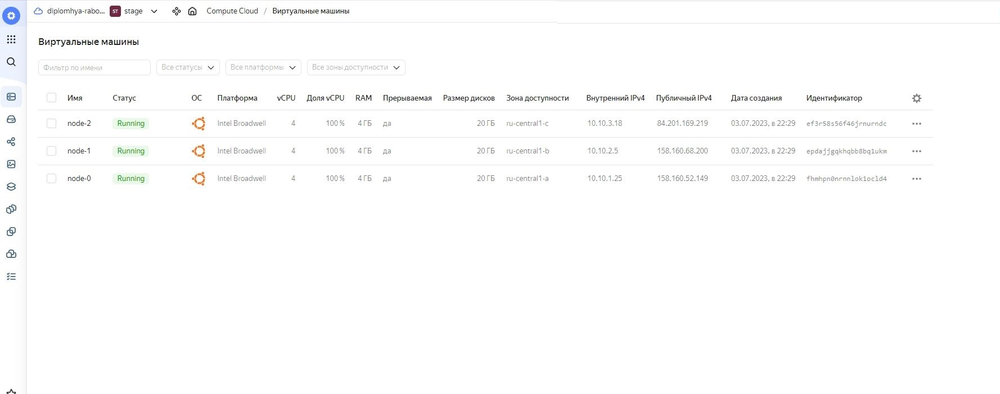

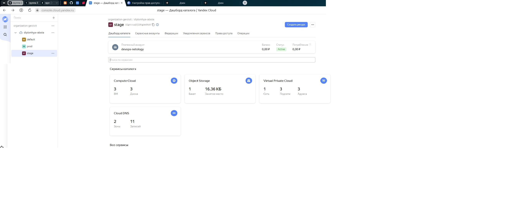

2. Полученная конфигурация инфраструктуры является предварительной, поэтому в ходе дальнейшего выполнения задания возможны изменения.

---
### Создание Kubernetes кластера

На этом этапе необходимо создать [Kubernetes](https://kubernetes.io/ru/docs/concepts/overview/what-is-kubernetes/) кластер на базе предварительно созданной инфраструктуры.   Требуется обеспечить доступ к ресурсам из Интернета.

Это можно сделать двумя способами:

1. Рекомендуемый вариант: самостоятельная установка Kubernetes кластера.  
   а. При помощи Terraform подготовить как минимум 3 виртуальных машины Compute Cloud для создания Kubernetes-кластера. Тип виртуальной машины следует выбрать самостоятельно с учётом требований к производительности и стоимости. Если в дальнейшем поймете, что необходимо сменить тип инстанса, используйте Terraform для внесения изменений.  
   б. Подготовить [ansible](https://www.ansible.com/) конфигурации, можно воспользоваться, например [Kubespray](https://kubernetes.io/docs/setup/production-environment/tools/kubespray/)  
   в. Задеплоить Kubernetes на подготовленные ранее инстансы, в случае нехватки каких-либо ресурсов вы всегда можете создать их при помощи Terraform.
2. Альтернативный вариант: воспользуйтесь сервисом [Yandex Managed Service for Kubernetes](https://cloud.yandex.ru/services/managed-kubernetes)  
  а. С помощью terraform resource для [kubernetes](https://registry.terraform.io/providers/yandex-cloud/yandex/latest/docs/resources/kubernetes_cluster) создать региональный мастер kubernetes с размещением нод в разных 3 подсетях      
  б. С помощью terraform resource для [kubernetes node group](https://registry.terraform.io/providers/yandex-cloud/yandex/latest/docs/resources/kubernetes_node_group)
 
### Решение
 
Создал [Kubernetes](https://kubernetes.io/ru/docs/concepts/overview/what-is-kubernetes/) кластер на базе предварительно созданной инфраструктуры.  Обеспечил доступ к ресурсам из Интернета.

Для выполнения данного задания использовал [Kubespray](https://kubernetes.io/docs/setup/production-environment/tools/kubespray/)

Ожидаемый результат:

1. Работоспособный Kubernetes кластер.

```commandline
(venv) root@server1:~/terraform/diploma/src/kubespray# ansible-playbook -i inventory/mycluster/hosts.yaml cluster.yml -b -v
Using /root/terraform/diploma/src/kubespray/ansible.cfg as config file
[WARNING]: Skipping callback plugin 'ara_default', unable to load

PLAY [localhost] ******************************************************************************************************************************************************
Thursday 20 July 2023  20:58:40 +0300 (0:00:00.168)       0:00:00.168 *********

TASK [Check 2.12.0 <= Ansible version < 2.16.0] ***********************************************************************************************************************
ok: [localhost] => {
    "changed": false,
    "msg": "All assertions passed"
}
Thursday 20 July 2023  20:58:40 +0300 (0:00:00.039)       0:00:00.207 *********

TASK [Check that python netaddr is installed] *************************************************************************************************************************
ok: [localhost] => {
    "changed": false,
    "msg": "All assertions passed"
}
Thursday 20 July 2023  20:58:40 +0300 (0:00:00.415)       0:00:00.623 *********

TASK [Check that jinja is not too old (install via pip)] **************************************************************************************************************
ok: [localhost] => {
    "changed": false,
    "msg": "All assertions passed"
}
[WARNING]: Could not match supplied host pattern, ignoring: kube-master

PLAY [Add kube-master nodes to kube_control_plane] ********************************************************************************************************************
skipping: no hosts matched
[WARNING]: Could not match supplied host pattern, ignoring: kube-node

PLAY [Add kube-node nodes to kube_node] *******************************************************************************************************************************
skipping: no hosts matched
[WARNING]: Could not match supplied host pattern, ignoring: k8s-cluster

PLAY [Add k8s-cluster nodes to k8s_cluster] ***************************************************************************************************************************
skipping: no hosts matched
[WARNING]: Could not match supplied host pattern, ignoring: calico-rr

PLAY [Add calico-rr nodes to calico_rr] *******************************************************************************************************************************
skipping: no hosts matched
[WARNING]: Could not match supplied host pattern, ignoring: no-floating

PLAY [Add no-floating nodes to no_floating] ***************************************************************************************************************************
skipping: no hosts matched
[WARNING]: Could not match supplied host pattern, ignoring: bastion

PLAY [bastion[0]] *****************************************************************************************************************************************************
skipping: no hosts matched

PLAY [k8s_cluster:etcd:calico_rr] *************************************************************************************************************************************
............................
..................
TASK [network_plugin/calico : Set calico_pool_conf] *******************************************************************************************************************
ok: [node0] => {"ansible_facts": {"calico_pool_conf": {"apiVersion": "projectcalico.org/v3", "kind": "IPPool", "metadata": {"creationTimestamp": "2023-07-03T20:29:34Z", "name": "default-pool", "resourceVersion": "13216", "uid": "4bfe17da-cfdf-4404-84e3-3da68464ff0d"}, "spec": {"allowedUses": ["Workload", "Tunnel"], "blockSize": 26, "cidr": "10.233.64.0/18", "ipipMode": "Never", "natOutgoing": true, "nodeSelector": "all()", "vxlanMode": "Always"}}}, "changed": false}
Thursday 20 July 2023  21:09:35 +0300 (0:00:00.048)       0:10:55.290 *********

TASK [network_plugin/calico : Check if inventory match current cluster configuration] *********************************************************************************
ok: [node0] => {
    "changed": false,
    "msg": "All assertions passed"
}
Thursday 20 July 2023  21:09:35 +0300 (0:00:00.053)       0:10:55.344 *********
Thursday 20 July 2023  21:09:35 +0300 (0:00:00.034)       0:10:55.379 *********
Thursday 20 July 2023  21:09:35 +0300 (0:00:00.034)       0:10:55.414 *********

PLAY RECAP ************************************************************************************************************************************************************
localhost                  : ok=3    changed=0    unreachable=0    failed=0    skipped=0    rescued=0    ignored=0
node0                      : ok=690  changed=41   unreachable=0    failed=0    skipped=1258 rescued=0    ignored=1
node1                      : ok=481  changed=21   unreachable=0    failed=0    skipped=774  rescued=0    ignored=1
node2                      : ok=481  changed=21   unreachable=0    failed=0    skipped=773  rescued=0    ignored=1
```

Файл inventory для ansible playbook
[hosts.yaml](kubespray/inventory/mycluster/hosts.yaml)

- Nodes

```commandline
(venv) root@server1:~/terraform/diploma/src/kubespray# kubectl get nodes
NAME    STATUS   ROLES           AGE   VERSION
node0   Ready    control-plane   17d   v1.26.6
node1   Ready    <none>          17d   v1.26.6
node2   Ready    <none>          17d   v1.26.6
```

<details>
<summary>Kubernetes кластер</summary>

```commandline
(venv) root@server1:~/terraform/diploma/src/kubespray# kubectl get all --all-namespaces
NAMESPACE     NAME                                                         READY   STATUS    RESTARTS         AGE
default       pod/myapp-pod-5bb5fbc745-gkr4w                               1/1     Running   8 (6h45m ago)    14d
kube-system   pod/calico-kube-controllers-6dfcdfb99-4s52d                  1/1     Running   10 (6h45m ago)   17d
kube-system   pod/calico-node-2wpf8                                        1/1     Running   11 (6h45m ago)   17d
kube-system   pod/calico-node-ltpj6                                        1/1     Running   10 (6h45m ago)   17d
kube-system   pod/calico-node-zgvdd                                        1/1     Running   10 (6h44m ago)   17d
kube-system   pod/coredns-645b46f4b6-24s8h                                 1/1     Running   10 (6h44m ago)   17d
kube-system   pod/coredns-645b46f4b6-w662t                                 1/1     Running   10 (6h45m ago)   17d
kube-system   pod/dns-autoscaler-659b8c48cb-xwf8c                          1/1     Running   10 (6h44m ago)   17d
kube-system   pod/kube-apiserver-node0                                     1/1     Running   11 (6h44m ago)   17d
kube-system   pod/kube-controller-manager-node0                            1/1     Running   12 (6h44m ago)   17d
kube-system   pod/kube-proxy-4789k                                         1/1     Running   0                6h32m
kube-system   pod/kube-proxy-bxrjh                                         1/1     Running   0                6h32m
kube-system   pod/kube-proxy-sxfs5                                         1/1     Running   0                6h32m
kube-system   pod/kube-scheduler-node0                                     1/1     Running   11 (6h44m ago)   17d
kube-system   pod/nginx-proxy-node1                                        1/1     Running   9 (6h45m ago)    16d
kube-system   pod/nginx-proxy-node2                                        1/1     Running   9 (6h45m ago)    16d
kube-system   pod/nodelocaldns-5m4xh                                       1/1     Running   21 (6h45m ago)   17d
kube-system   pod/nodelocaldns-b2qsl                                       1/1     Running   16 (6h45m ago)   17d
kube-system   pod/nodelocaldns-zh7fh                                       1/1     Running   11 (6h44m ago)   17d
monitoring    pod/alertmanager-stable-kube-prometheus-sta-alertmanager-0   2/2     Running   12 (6h45m ago)   11d
monitoring    pod/prometheus-stable-kube-prometheus-sta-prometheus-0       2/2     Running   12 (6h45m ago)   11d
monitoring    pod/stable-grafana-7f9f4cfd65-zsqm8                          3/3     Running   18 (6h45m ago)   11d
monitoring    pod/stable-kube-prometheus-sta-operator-69fd4dd56b-64zkb     1/1     Running   7 (6h45m ago)    11d
monitoring    pod/stable-kube-state-metrics-9d5694c74-sm2hz                1/1     Running   9 (6h45m ago)    11d
monitoring    pod/stable-prometheus-node-exporter-29v4z                    1/1     Running   6 (6h45m ago)    11d
monitoring    pod/stable-prometheus-node-exporter-rp8hj                    1/1     Running   6 (6h45m ago)    11d
monitoring    pod/stable-prometheus-node-exporter-xhb2t                    1/1     Running   6 (6h44m ago)    11d
stage         pod/app-web-7cf8986d9d-9brcs                                 1/1     Running   0                63m

NAMESPACE      NAME                                                         TYPE        CLUSTER-IP      EXTERNAL-IP   PORT(S)                         AGE
default        service/kubernetes                                           ClusterIP   10.233.0.1      <none>        443/TCP                         17d
default        service/myservice                                            NodePort    10.233.34.202   <none>        80:32000/TCP                    14d
default        service/stable-kube-prometheus-sta-prometheus                ClusterIP   10.233.5.89     <none>        9090/TCP,8080/TCP               14d
devops-tools   service/jenkins-service                                      NodePort    10.233.33.14    <none>        8080:32222/TCP                  10d
kube-system    service/coredns                                              ClusterIP   10.233.0.3      <none>        53/UDP,53/TCP,9153/TCP          17d
kube-system    service/prometheus-kube-prometheus-kubelet                   ClusterIP   None            <none>        10250/TCP,10255/TCP,4194/TCP    14d
kube-system    service/stable-kube-prometheus-sta-coredns                   ClusterIP   None            <none>        9153/TCP                        11d
kube-system    service/stable-kube-prometheus-sta-kube-controller-manager   ClusterIP   None            <none>        10257/TCP                       11d
kube-system    service/stable-kube-prometheus-sta-kube-etcd                 ClusterIP   None            <none>        2381/TCP                        11d
kube-system    service/stable-kube-prometheus-sta-kube-proxy                ClusterIP   None            <none>        10249/TCP                       11d
kube-system    service/stable-kube-prometheus-sta-kube-scheduler            ClusterIP   None            <none>        10259/TCP                       11d
kube-system    service/stable-kube-prometheus-sta-kubelet                   ClusterIP   None            <none>        10250/TCP,10255/TCP,4194/TCP    14d
monitoring     service/alertmanager-operated                                ClusterIP   None            <none>        9093/TCP,9094/TCP,9094/UDP      11d
monitoring     service/prometheus-operated                                  ClusterIP   None            <none>        9090/TCP                        11d
monitoring     service/stable-grafana                                       NodePort    10.233.8.137    <none>        80:30259/TCP                    11d
monitoring     service/stable-kube-prometheus-sta-alertmanager              ClusterIP   10.233.31.31    <none>        9093/TCP,8080/TCP               11d
monitoring     service/stable-kube-prometheus-sta-operator                  ClusterIP   10.233.26.128   <none>        443/TCP                         11d
monitoring     service/stable-kube-prometheus-sta-prometheus                NodePort    10.233.48.224   <none>        9090:30013/TCP,8080:31313/TCP   11d
monitoring     service/stable-kube-state-metrics                            ClusterIP   10.233.39.82    <none>        8080/TCP                        11d
monitoring     service/stable-prometheus-node-exporter                      ClusterIP   10.233.63.146   <none>        9100/TCP                        11d
stage          service/app-web                                              NodePort    10.233.35.199   <none>        80:30080/TCP                    4d2h

NAMESPACE     NAME                                             DESIRED   CURRENT   READY   UP-TO-DATE   AVAILABLE   NODE SELECTOR            AGE
kube-system   daemonset.apps/calico-node                       3         3         3       3            3           kubernetes.io/os=linux   17d
kube-system   daemonset.apps/kube-proxy                        3         3         3       3            3           kubernetes.io/os=linux   17d
kube-system   daemonset.apps/nodelocaldns                      3         3         3       3            3           kubernetes.io/os=linux   17d
monitoring    daemonset.apps/stable-prometheus-node-exporter   3         3         3       3            3           kubernetes.io/os=linux   11d

NAMESPACE     NAME                                                  READY   UP-TO-DATE   AVAILABLE   AGE
default       deployment.apps/myapp-pod                             1/1     1            1           14d
kube-system   deployment.apps/calico-kube-controllers               1/1     1            1           17d
kube-system   deployment.apps/coredns                               2/2     2            2           17d
kube-system   deployment.apps/dns-autoscaler                        1/1     1            1           17d
monitoring    deployment.apps/stable-grafana                        1/1     1            1           11d
monitoring    deployment.apps/stable-kube-prometheus-sta-operator   1/1     1            1           11d
monitoring    deployment.apps/stable-kube-state-metrics             1/1     1            1           11d
stage         deployment.apps/app-web                               1/1     1            1           4d2h

NAMESPACE     NAME                                                             DESIRED   CURRENT   READY   AGE
default       replicaset.apps/myapp-pod-5bb5fbc745                             1         1         1       14d
kube-system   replicaset.apps/calico-kube-controllers-6dfcdfb99                1         1         1       17d
kube-system   replicaset.apps/coredns-645b46f4b6                               2         2         2       17d
kube-system   replicaset.apps/dns-autoscaler-659b8c48cb                        1         1         1       17d
monitoring    replicaset.apps/stable-grafana-7f9f4cfd65                        1         1         1       11d
monitoring    replicaset.apps/stable-kube-prometheus-sta-operator-69fd4dd56b   1         1         1       11d
monitoring    replicaset.apps/stable-kube-state-metrics-9d5694c74              1         1         1       11d
stage         replicaset.apps/app-web-55c47c594                                0         0         0       115m
stage         replicaset.apps/app-web-564fcddc9d                               0         0         0       4h38m
stage         replicaset.apps/app-web-656696cccc                               0         0         0       4h31m
stage         replicaset.apps/app-web-68c4f7b55c                               0         0         0       135m
stage         replicaset.apps/app-web-6b5f98df8c                               0         0         0       4d2h
stage         replicaset.apps/app-web-796d66c8f                                0         0         0       160m
stage         replicaset.apps/app-web-7bdf4444b4                               0         0         0       179m
stage         replicaset.apps/app-web-7cf8986d9d                               1         1         1       63m
stage         replicaset.apps/app-web-94b5b6474                                0         0         0       165m

NAMESPACE    NAME                                                                    READY   AGE
monitoring   statefulset.apps/alertmanager-stable-kube-prometheus-sta-alertmanager   1/1     11d
monitoring   statefulset.apps/prometheus-stable-kube-prometheus-sta-prometheus       1/1     11d
```

</details>

2. В файле `~/.kube/config` находятся данные для доступа к кластеру.

<details>
<summary>файл `~/.kube/config` выглядит так</summary>

```commandline
(venv) root@server1:~/terraform/diploma/src/terraform# cat ~/.kube/config
apiVersion: v1
clusters:
- cluster:
    certificate-authority-data: LS0tLS1CRUdJTiBDRVJUSUZJQ0FURS0tLS0tCk1JSUMvakNDQWVhZ0F3SUJBZ0lCQURBTkJna3Foa2lHOXcwQkFRc0ZBREFWTVJNd0VRWURWUVFERXdwcmRXSmwKY201bGRHVnpNQjRYRFRJek1EY3dNekl3TWpjMU0xb1hEVE16TURZek1ESXdNamMxTTFvd0ZURVRNQkVHQTFVRQpBeE1LYTNWaVpYSnVaWFJsY3pDQ0FTSXdEUVlKS29aSWh2Y05BUUVCQlFBRGdnRVBBRENDQVFvQ2dnRUJBS2JtCmdVTEtaWk80L2FuNDRqYXpiMDRYVmhzSzJwUldGbE9XVVJORTlMVy9QU3I3T2NFM09iSGZRSXJsL1RsVFg1c04KZGJrTUljZWRrMTk1SE16dFgxbXRUMnBJYUZydXRTd1duNytJUDB6WHVsR29HTm13KzRJenFNdVJKaGxra1J4dQpDM2NlT0Jnd25nMGplNVBLb05nR3pycXZIUEFkeDRLU2tYVmpRbnJ4VjhkbG80WktEWnBHYUdEcDBOQkJ0R0NrCjdxa3F6OFUyZ29HRWU5UDBXYnMvTCs2MTU2RGhkZkUxTzA0L3hGS0MzWXBvMzU3S2xqOVcvRUtGN24wc3ZvMVQKUXlscFVieGc3TUZ6T05lWCsraFVIQW9sSXI5SGRWcjF5MzRiazh1VGY0WkR0RkhUZjRmNTBBMjJ6Rnl6VXBsTwp4MjJJYjE2NEdFakJlbkljRmY4Q0F3RUFBYU5aTUZjd0RnWURWUjBQQVFIL0JBUURBZ0trTUE4R0ExVWRFd0VCCi93UUZNQU1CQWY4d0hRWURWUjBPQkJZRUZKRi9pWnIrbGZ6R0c2RUFTd2lSOUJIS3c0SjdNQlVHQTFVZEVRUU8KTUF5Q0NtdDFZbVZ5Ym1WMFpYTXdEUVlKS29aSWh2Y05BUUVMQlFBRGdnRUJBRG1UbktIK3hRaVJmWDVuTU5JRQpTSEdZc0FGaWs0V0VSek53R0lpa2gwK3lDUkZKQzFsZEMzaTZLVnJaVDUrQXVSU0pGeGhzU1hoMU9mVVdlRkRUCm4vdzJIOVAwSWM0MEZUUVQ1eTF5ZXlqY3lIOWVNUk55YnZlbGhIdlBjM1JBcDRTN3p6a0pNK0QzUDZvMkxSeHYKNUtoWVU3alAyRzZzTVdqaWlzeFdNLzJJTXBpNWszN0IvS05ibVAxU2IxZHFOTHhndUFoaHhJeFRTREJrd1F6NQpvdUFYOGdXZFQycFhEY2lsVFBQL1hqOU5wRThCQlBOQ2tYNWJ5b1pwQjlVTFdNSEUzbVlWdFNNMzRoNnh0TWtMCmJpa0tzb1NTYlJ1bXhJZGVkWktCU1IvYWwxa0h4L0tJMGJWelZudkNHNTR0ZUtxaWgreHdydEpkNFJPSEZHRmUKR3A4PQotLS0tLUVORCBDRVJUSUZJQ0FURS0tLS0tCg==
    server: https://158.160.116.38:6443
  name: cluster.local
contexts:
- context:
    cluster: cluster.local
    user: kubernetes-admin
  name: kubernetes-admin@cluster.local
current-context: kubernetes-admin@cluster.local
kind: Config
preferences: {}
users:
- name: kubernetes-admin
  user:
    client-certificate-data: xxxxxxxxxxxxxxxxUZJQ0FURS0tLS0tCk1JSURJVENDQWdtZ0F3SUJBZ0lJYmozWlVqNXNCNTR3RFFZSktvWklodmNOQVFFTEJRQXdGVEVUTUJFR0ExVUUKQXhNS2EzVmlaWEp1WlhSbGN6QWVGdzB5TXpBM01ETXlNREkzTlROYUZ3MHlOREEzTURJeU1ESTNOVFJhTURReApGekFWQmdOVkJBb1REbk41YzNSbGJUcHRZWE4wWlhKek1Sa3dGd1lEVlFRREV4QnJkV0psY201bGRHVnpMV0ZrCmJXbHVNSUlCSWpBTkJna3Foa2lHOXcwQkFRRUZBQU9DQVE4QU1JSUJDZ0tDQVFFQTJjaGU1WHVBdjVOQjhCakYKQVVrZmM1U0dTbDZBNU9qaE5iUzh4OHNkYTFQam1rYVNKQ2F3YXIrSU9uQ0NSQytnZnNkWURRc09ETlgwb3ZLUgpCcUFNTWVDbEdsL2IzU21yM1NxZEU3RFNDUzM4Vm1HQkVSc0pudEVjWG9FVHZmUTBCUVQ4Yko5NlBZcCt2NzNlCnNkU0tXMG55OWh4NFFTUC85YTNNZmtXcmJPYjFpZktBZmpHQm1FTWdObzJxc0VZNDJHU0FXYnE5Vm1vUVV2RW4KZFNTOHVTUml0UThlNysyUnpaZm1ubko5alcxSTZrbVRTa2NTTStEdGVFSWhpNmtXMElDZGIwN1MzeXNNQUxMYQowREo2L1BuMTVRcTdNZzhkRklvYlBZMUxldldHK0w0Yit1dGxPditmY0k2amI2QlcrcWxkZDRDOHhHMXNscXJpCjlYbi9KUUlEQVFBQm8xWXdWREFPQmdOVkhROEJBZjhFQkFNQ0JhQXdFd1lEVlIwbEJBd3dDZ1lJS3dZQkJRVUgKQXdJd0RBWURWUjBUQVFIL0JBSXdBREFmQmdOVkhTTUVHREFXZ0JTUmY0bWEvcFg4eGh1aEFFc0lrZlFSeXNPQwplekFOQmdrcWhraUc5dzBCQVFzRkFBT0NBUUVBUEhTdTBSUGY3bFN1Y3FreFoyT0dUeXVHZzI0b3IxTW5HN1prCk03T3MxZ0wzdTBOd210ZVFjSWtneXdzb1lGOVczVE9TQUhia1I0T0piMVFPUk80bkF2UjZwU3VBdW9NVnRDUGcKSDBEUUI5aVN3WlA3cmlYYWU0L05JbE9mQmpLTFgwZ3JVck5zL2k0ajFqRHFJbHBsdllwa2Y3Qm44aTdsN1l4bgpTV01raHpqQm5TYkVzZEJWVnVvWmRkSjVlWS8yUjR6WU10cTBJSXd3MUFWMlkzY0c0bE1veGRmREVuTzJJN1haCmFaSG9DbkRXbEdKMFd4MGJPMk5NYzRFZ05hTTVkZ2dXYld2ZWdvdjlXOU9ObzFIMENsYWQ3bWI0dmlKenV1aXMKRGpmajZxWFUwYU1NcXJDd0Jpelh5eHlDdnRaM0ZieWtTN0IvUnpVL2VSQlBiYkwwYUE9PQotLS0tLUVORCBDRVJUSUZJQ0FURS0tLS0tCg==
    client-key-data: xxxxxxxxxxxxxxxxxxxJJVkFURSBLRVktLS0tLQpNSUlFcEFJQkFBS0NBUUVBMmNoZTVYdUF2NU5COEJqRkFVa2ZjNVNHU2w2QTVPamhOYlM4eDhzZGExUGpta2FTCkpDYXdhcitJT25DQ1JDK2dmc2RZRFFzT0ROWDBvdktSQnFBTU1lQ2xHbC9iM1NtcjNTcWRFN0RTQ1MzOFZtR0IKRVJzSm50RWNYb0VUdmZRMEJRVDhiSjk2UFlwK3Y3M2VzZFNLVzBueTloeDRRU1AvOWEzTWZrV3JiT2IxaWZLQQpmakdCbUVNZ05vMnFzRVk0MkdTQVdicTlWbW9RVXZFbmRTUzh1U1JpdFE4ZTcrMlJ6WmZtbm5KOWpXMUk2a21UClNrY1NNK0R0ZUVJaGk2a1cwSUNkYjA3UzN5c01BTExhMERKNi9QbjE1UXE3TWc4ZEZJb2JQWTFMZXZXRytMNGIKK3V0bE92K2ZjSTZqYjZCVytxbGRkNEM4eEcxc2xxcmk5WG4vSlFJREFRQUJBb0lCQUE2K2p4WXdUMTRwQlJ6UgpRSDAreXg5VEhlaHBENGJ2OFZkbWZpVjByZkEzUk1DTUtKYkQrOHV1WGZXKzZrTGRpcHNxdWQ1Z01qcFNQZmJPClAxMVlkcHJsMzZleWQ3czRlQWRJUEV3NSsyNWRxNmpaZnhoK1lSOWNmdlF5L3Znc1VWMUpvaUZraHEwbDlFRGQKQlBlN01RYlBNZURSdXA2R1ptem1zR0tZS3V2N2N3Y2NobVZrMkRkVDlGQ1hweFJlWE5ERzl0SFBTdnVFa2t2dwpTMmFDNjVVd1ZyT2lsQVUwdUpDREI4TFppd01NckpWV2tDOUVtWFNTZSt2MjNsdTU4cm1ZTGRyOUtKcFhPczB6CmRJMk5UNWZaZFpMaHNvRVFWMzRORjhwR0dhQ25wTEw4dTYrM0o3UzNFelc2WWYyMEJVb3Zhd1k5SVdGUTNra1IKSEJTK3ZYMENnWUVBOGI2blpUbWxUY0tBWmZYYmMrVHJYNHNpUDM4Ritra0NKQ09saWkweFkzVzdiM2dGTVVzZwpCa3E0aTJJMUEyT3BVaUREeDdjREZxWWhIVHZlWWVRVklYdDJwZFRUUHJYM0o4M3IwRm0zOFRXcllERUV4dy9WCk5yNUFOaEpxakZZN09lbzQvYUtuWlgxSVUvcmFFUDBoZGNBYjV2OVBmc3ZJQjNhY2tJU0krd3NDZ1lFQTVwLzkKTDgvOGozS0RPV0p6Vi9mOGo5aU5HL0VIT1BBQm94eUNoYUw2TllyMVZSZnNkeGJ4R1c1NG8vOXBDOUFmZmZnLwpteDZzVUdwaWZVekpuMDltV2hqUEpmdGF4ZDNjVExoRjBJanpEdUFkRG9BVXBOOU9sS3gwSTJicWNMOTBXaXpYCjdwcVJkaFdad2ljMEo5R2kvNUMxNVdIYTFhRkhiaUV2NUpoYnpJOENnWUIyR3FFSmtUb3pYVDBCa3pYZHp3ODMKSkhCYytSL2dnVjZzYlVYbzFkOTFLZ1dpbGM1am9NSktrS0xNWmZSa2JZSkJmNFJteEFDY1JobVRnTFpLdVBXaAo0QUc5VHRiTm9uVFhXNEZEenpGUWhObnZLc09jeFIxem0wc2ZuNnV5V0VhaktzMGhEU0FmTXkvczUzYzJLWlQ1ClJCdmRwUW9mZGt1SmFlZGZxNENJdFFLQmdRQzFlb0l1eEpqMmZHTDhuaGNyeXczb1Y3eTZseEZhNGFvNEkzQW0KSHRpTGw1eDBhSTRBTElKdXc3cVZPcC83MXJ0aFVoOGpQcURUNnRNenpHQUFSK2UvMERQNXJIQ0NzWkh3b1RUMgo0ejE0b0N6ZFF6WjdndW1BSHJDSlJ5d0dxdkd4SUFhUFVQeFVFcTFhMWFTNkRNSWFIMUt6ZlN4SjNVNnJQOXhECkl3MWh5d0tCZ1FDdjY1aWN2aXJOVFN6S2ZuanV0dk0ydjFFdmFlMFVvaG81K2FVQk5IbHpBR1Z4TTZ2M2tqelQKdkFNTHVNdE0vaTVUTGd3SzNPOHpjNGVqaVd4czZQL0RiMlF6T0o5MFBIa2dVKzdrdmF3emdWcjF5VUtIVVlFTApIK0xibHkxRk5PZFBSa3ROMDN2eGFVRUdXNUtyWlNBMFNHdnhHbXNLSGFFNHMvaWJYSllaSUE9PQotLS0tLUVORCBSU0EgUFJJVkFURSBLRVktLS0tLQo=(venv) root@server1:~/terraform/di
```
</details>

3. Команда `kubectl get pods --all-namespaces` отрабатывает без ошибок.

<details>
<summary>команда `kubectl get pods --all-namespaces`</summary>

```commandline
(venv) root@server1:~/terraform/diploma/src/kubespray# kubectl get pods --all-namespaces
NAMESPACE     NAME                                                     READY   STATUS    RESTARTS       AGE
default       myapp-pod-5bb5fbc745-gkr4w                               1/1     Running   8 (49m ago)    14d
kube-system   calico-kube-controllers-6dfcdfb99-4s52d                  1/1     Running   10 (49m ago)   16d
kube-system   calico-node-2wpf8                                        1/1     Running   11 (49m ago)   16d
kube-system   calico-node-ltpj6                                        1/1     Running   10 (49m ago)   16d
kube-system   calico-node-zgvdd                                        1/1     Running   10 (49m ago)   16d
kube-system   coredns-645b46f4b6-24s8h                                 1/1     Running   10 (49m ago)   16d
kube-system   coredns-645b46f4b6-w662t                                 1/1     Running   10 (49m ago)   16d
kube-system   dns-autoscaler-659b8c48cb-xwf8c                          1/1     Running   10 (49m ago)   16d
kube-system   kube-apiserver-node0                                     1/1     Running   11 (49m ago)   16d
kube-system   kube-controller-manager-node0                            1/1     Running   12 (49m ago)   16d
kube-system   kube-proxy-4789k                                         1/1     Running   0              36m
kube-system   kube-proxy-bxrjh                                         1/1     Running   0              36m
kube-system   kube-proxy-sxfs5                                         1/1     Running   0              36m
kube-system   kube-scheduler-node0                                     1/1     Running   11 (49m ago)   16d
kube-system   nginx-proxy-node1                                        1/1     Running   9 (49m ago)    16d
kube-system   nginx-proxy-node2                                        1/1     Running   9 (49m ago)    16d
kube-system   nodelocaldns-5m4xh                                       1/1     Running   21 (49m ago)   16d
kube-system   nodelocaldns-b2qsl                                       1/1     Running   16 (49m ago)   16d
kube-system   nodelocaldns-zh7fh                                       1/1     Running   11 (49m ago)   16d
monitoring    alertmanager-stable-kube-prometheus-sta-alertmanager-0   2/2     Running   12 (49m ago)   10d
monitoring    prometheus-stable-kube-prometheus-sta-prometheus-0       2/2     Running   12 (49m ago)   10d
monitoring    stable-grafana-7f9f4cfd65-zsqm8                          3/3     Running   18 (49m ago)   10d
monitoring    stable-kube-prometheus-sta-operator-69fd4dd56b-64zkb     1/1     Running   7 (49m ago)    10d
monitoring    stable-kube-state-metrics-9d5694c74-sm2hz                1/1     Running   9 (49m ago)    10d
monitoring    stable-prometheus-node-exporter-29v4z                    1/1     Running   6 (49m ago)    10d
monitoring    stable-prometheus-node-exporter-rp8hj                    1/1     Running   6 (49m ago)    10d
monitoring    stable-prometheus-node-exporter-xhb2t                    1/1     Running   6 (49m ago)    10d
stage         app-web-6b5f98df8c-fkgcq                                 1/1     Running   1 (49m ago)    3d20h
```
</details>


---
### Создание тестового приложения

Для перехода к следующему этапу необходимо подготовить тестовое приложение, эмулирующее основное приложение разрабатываемое вашей компанией.

Способ подготовки:

1. Рекомендуемый вариант:  
   а. Создайте отдельный git репозиторий с простым nginx конфигом, который будет отдавать статические данные.  
   б. Подготовьте Dockerfile для создания образа приложения.  
2. Альтернативный вариант:  
   а. Используйте любой другой код, главное, чтобы был самостоятельно создан Dockerfile.

### Решение

Получил ожидаемый результат:

[Git репозиторий](https://github.com/Vitalya-Mozgovoy/myapp) с тестовым приложением 

В качестве регистра использовал  Yandex Container Registry 

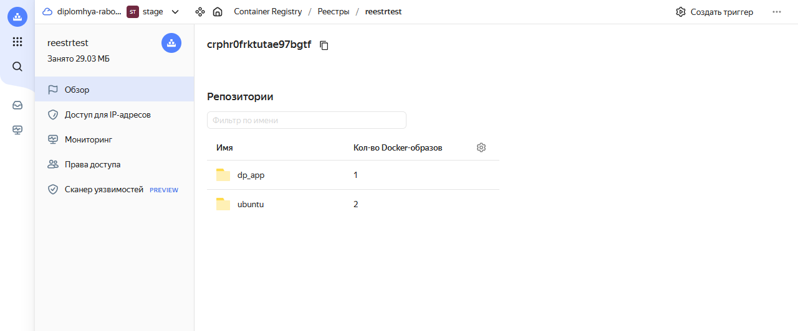

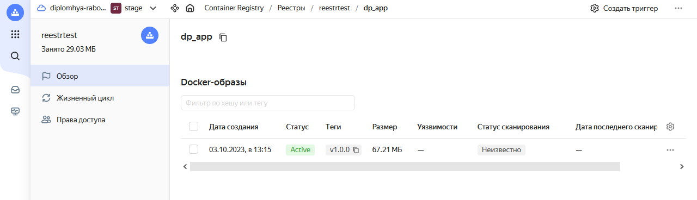


### Подготовка cистемы мониторинга и деплой приложения

Уже должны быть готовы конфигурации для автоматического создания облачной инфраструктуры и поднятия Kubernetes кластера.  
Теперь необходимо подготовить конфигурационные файлы для настройки нашего Kubernetes кластера.

Цель:
1. Задеплоить в кластер [prometheus](https://prometheus.io/), [grafana](https://grafana.com/), [alertmanager](https://github.com/prometheus/alertmanager), [экспортер](https://github.com/prometheus/node_exporter) основных метрик Kubernetes.
2. Задеплоить тестовое приложение, например, [nginx](https://www.nginx.com/) сервер отдающий статическую страницу.

Рекомендуемый способ выполнения:
1. Воспользоваться пакетом [kube-prometheus](https://github.com/prometheus-operator/kube-prometheus), который уже включает в себя [Kubernetes оператор](https://operatorhub.io/) для [grafana](https://grafana.com/), [prometheus](https://prometheus.io/), [alertmanager](https://github.com/prometheus/alertmanager) и [node_exporter](https://github.com/prometheus/node_exporter). При желании можете собрать все эти приложения отдельно.
2. Для организации конфигурации использовать [qbec](https://qbec.io/), основанный на [jsonnet](https://jsonnet.org/). Обратите внимание на имеющиеся функции для интеграции helm конфигов и [helm charts](https://helm.sh/)
3. Если на первом этапе вы не воспользовались [Terraform Cloud](https://app.terraform.io/), то задеплойте в кластер [atlantis](https://www.runatlantis.io/) для отслеживания изменений инфраструктуры.

Альтернативный вариант:
1. Для организации конфигурации можно использовать [helm charts](https://helm.sh/)

### Решение


Ожидаемый результат:
1. Git репозиторий с конфигурационными файлами для настройки Kubernetes.

#### [Kubespray](https://github.com/kubernetes-sigs/kubespray)

Конфигурация [для создания кластера](kubespray/inventory/mycluster/hosts.yaml).

Файл для назначения параметра [для подключения через внешний адрес мастера](kubespray/inventory/mycluster/group_vars/k8s_cluster/k8s-cluster.yml).

2. Http доступ к web интерфейсу grafana.

Кластер [prometheus](https://prometheus.io/), [grafana](https://grafana.com/), [alertmanager](https://github.com/prometheus/alertmanager), [экспортер](https://github.com/prometheus/node_exporter) основных метрик Kubernetes задеплоил с помощью [helm charts](https://helm.sh/)

```commandline
(venv) root@server1:~/terraform/diploma/src/terraform# helm install stable prometheus-community/kube-prometheus-stack --namespace=monitoring
NAME: stable
LAST DEPLOYED: Sun Jul  9 22:42:44 2023
NAMESPACE: monitoring
STATUS: deployed
REVISION: 1
NOTES:
kube-prometheus-stack has been installed. Check its status by running:
  kubectl --namespace monitoring get pods -l "release=stable"

Visit https://github.com/prometheus-operator/kube-prometheus for instructions on how to create & configure Alertmanager and Prometheus instances using the Operator.
```
Чтобы подключаться к серверу извне перенастроим сервисы(svc) созданные для `kube-prometheus-stack`.
```commandline
(venv) root@server1:~/terraform/diploma/src/terraform# kubectl edit svc stable-kube-prometheus-sta-prometheus -n monitoring
service/stable-kube-prometheus-sta-prometheus edited
(venv) root@server1:~/terraform/diploma/src/terraform# kubectl edit svc stable-grafana -n monitoring
service/stable-grafana edited
(venv) root@server1:~/terraform/diploma/src/terraform# kubectl get svc -n monitoring
NAME                                      TYPE        CLUSTER-IP      EXTERNAL-IP   PORT(S)                         AGE
alertmanager-operated                     ClusterIP   None            <none>        9093/TCP,9094/TCP,9094/UDP      18m
prometheus-operated                       ClusterIP   None            <none>        9090/TCP                        18m
stable-grafana                            NodePort    10.233.8.137    <none>        80:30259/TCP                    18m
stable-kube-prometheus-sta-alertmanager   ClusterIP   10.233.31.31    <none>        9093/TCP,8080/TCP               18m
stable-kube-prometheus-sta-operator       ClusterIP   10.233.26.128   <none>        443/TCP                         18m
stable-kube-prometheus-sta-prometheus     NodePort    10.233.48.224   <none>        9090:30013/TCP,8080:31313/TCP   18m
stable-kube-state-metrics                 ClusterIP   10.233.39.82    <none>        8080/TCP                        18m
stable-prometheus-node-exporter           ClusterIP   10.233.63.146   <none>        9100/TCP                        18m
```

Prometheus

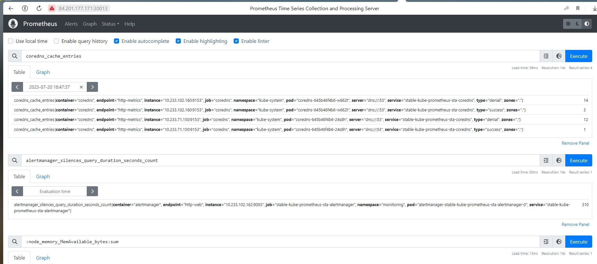

3. Дашборды в grafana отображающие состояние Kubernetes кластера.

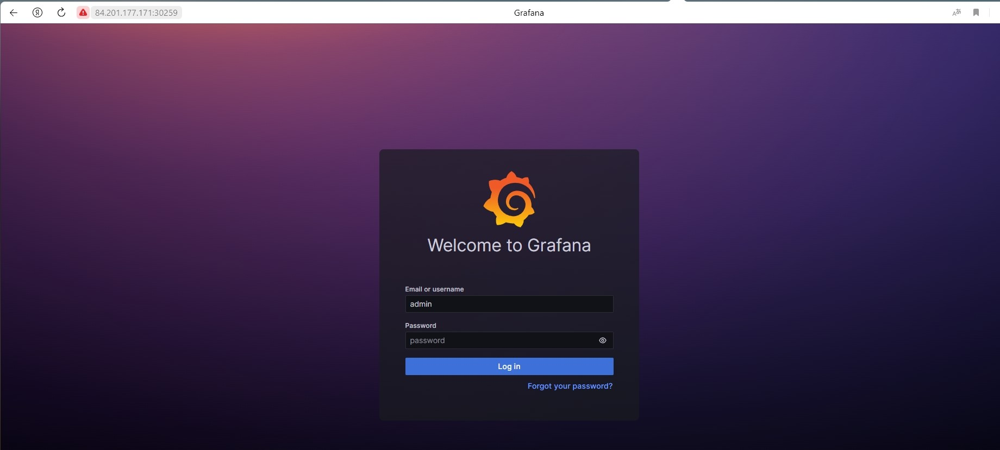

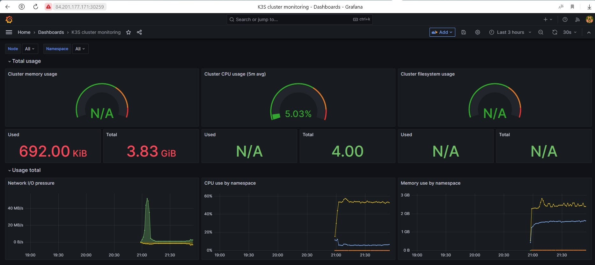

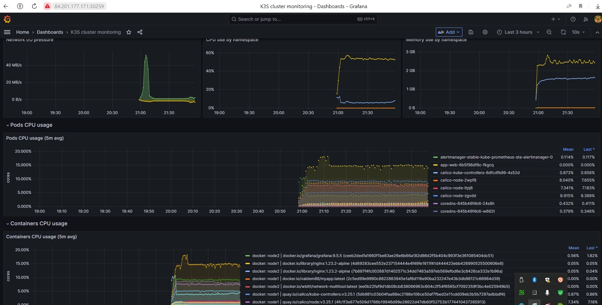


4. Http доступ к тестовому приложению.

```commandline
NAME            READY   UP-TO-DATE   AVAILABLE   AGE
app-web-myapp   1/1     1            1           6h42m
(venv) root@server1:~/terraform/diploma/src/terraform# kubectl get svc -n stage
NAME            TYPE       CLUSTER-IP      EXTERNAL-IP   PORT(S)        AGE
app-web-myapp   NodePort   10.233.38.180   <none>        80:30080/TCP   6h42m
```
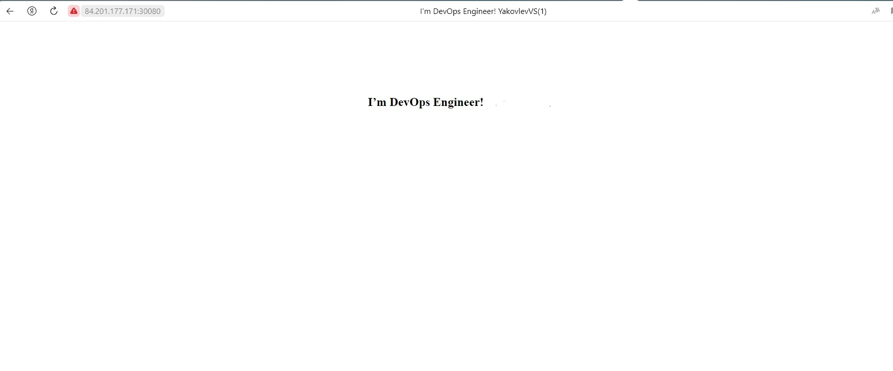

---
### Установка и настройка CI/CD

Осталось настроить ci/cd систему для автоматической сборки docker image и деплоя приложения при изменении кода.

Цель:

1. Автоматическая сборка docker образа при коммите в репозиторий с тестовым приложением.
2. Автоматический деплой нового docker образа.

Можно использовать [teamcity](https://www.jetbrains.com/ru-ru/teamcity/), [jenkins](https://www.jenkins.io/), [GitLab CI](https://about.gitlab.com/stages-devops-lifecycle/continuous-integration/) или GitHub Actions.


### Решение

Получил ожидаемый результат:

Для выполнения этого задания использовал ci/cd [jenkins](https://www.jenkins.io/)

В YC была развернута виртуальная машина с дальнейшей установкой на ней ci/cd с помощью docker container. 

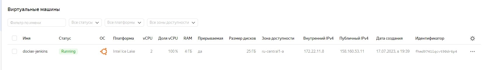

Создан собственный образ. [Dockerfile для создания](jenkins/blue/Dockerfile) 

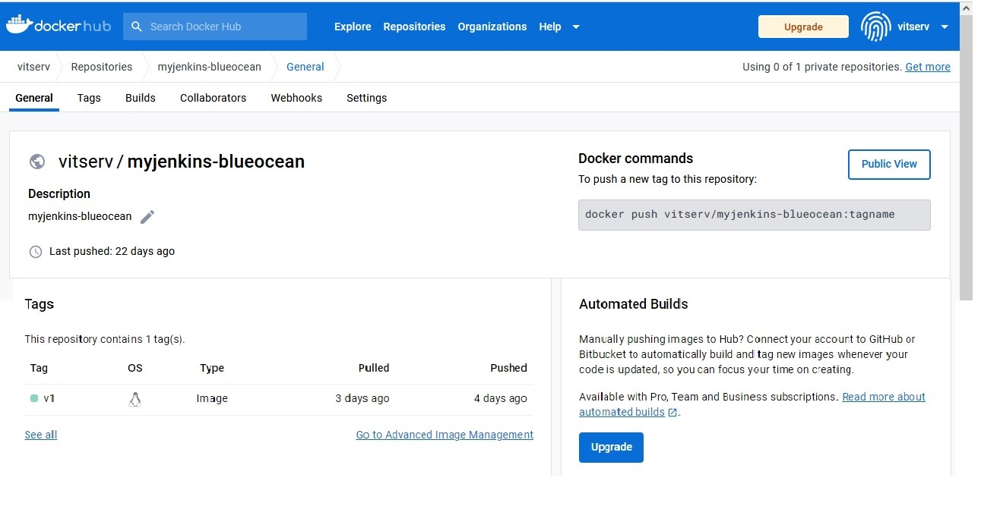

Далее подключаюсь на созданную машину и выполняю скрипт [jenkins-install.sh](jenkins/jenkins-install.sh)
Поднимаются контейнеры jenkins и dind(нужен для работы docker).

```commandline
root@docker-jenkins:/home/vitserv# docker ps
CONTAINER ID   IMAGE                             COMMAND                  CREATED      STATUS       PORTS                                                                                      NAMES
39e12bc18fb2   docker:dind                       "dockerd-entrypoint.…"   2 days ago   Up 8 hours   2375/tcp, 0.0.0.0:2376->2376/tcp, :::2376->2376/tcp                                        jenkins-docker
fe849d039158   vitserv/myjenkins-blueocean:v1   "/usr/bin/tini -- /u…"   3 days ago   Up 8 hours   0.0.0.0:8080->8080/tcp, :::8080->8080/tcp, 0.0.0.0:50000->50000/tcp, :::50000->50000/tcp   jenkins-blueocean
```

1. Интерфейс ci/cd сервиса доступен по http.

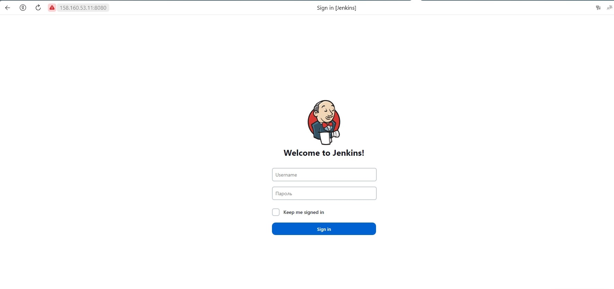

2. При любом коммите в репозиторие с тестовым приложением происходит сборка и отправка в регистр Docker образа.

Автоматический запуск pipline выполняется с помощью настройки `webhooks` в репозитории приложения. По определению наличия изменений.

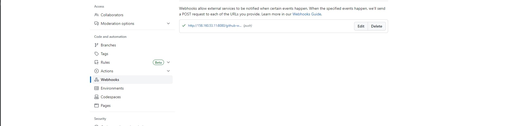

Запуск
```commandline
(venv) root@server1:~/terraform/diploma/src/myapp# git status
On branch main
Your branch is ahead of 'origin/main' by 1 commit.
  (use "git push" to publish your local commits)

Changes not staged for commit:
  (use "git add <file>..." to update what will be committed)
  (use "git restore <file>..." to discard changes in working directory)
        modified:   content/index.html
        modified:   myapp-deploy.yml

no changes added to commit (use "git add" and/or "git commit -a")
(venv) root@server1:~/terraform/diploma/src/myapp# git add content/index.html myapp-deploy.yml
(venv) root@server1:~/terraform/diploma/src/myapp# git status
On branch main
Your branch is ahead of 'origin/main' by 1 commit.
  (use "git push" to publish your local commits)

Changes to be committed:
  (use "git restore --staged <file>..." to unstage)
        modified:   content/index.html
        modified:   myapp-deploy.yml

(venv) root@server1:~/terraform/diploma/src/myapp# git commit -m "commit_all tag=1.0.8"
[main 3fee4ff] commit_all tag=1.0.8
 2 files changed, 3 insertions(+), 3 deletions(-)
(venv) root@server1:~/terraform/diploma/src/myapp# git tag -a 1.0.8 -m "my version app 1.0.8"
(venv) root@server1:~/terraform/diploma/src/myapp# git push origin 1.0.8
Username for 'https://github.com': valdem88
Password for 'https://valdem88@github.com':
Enumerating objects: 10, done.
Counting objects: 100% (10/10), done.
Compressing objects: 100% (5/5), done.
Writing objects: 100% (6/6), 587 bytes | 587.00 KiB/s, done.
Total 6 (delta 3), reused 0 (delta 0)
remote: Resolving deltas: 100% (3/3), completed with 3 local objects.
To https://github.com/Valdem88/myapp.git
 * [new tag]         1.0.8 -> 1.0.8
(venv) root@server1:~/terraform/diploma/src/myapp#
```

Создается образ с тегом `latest`

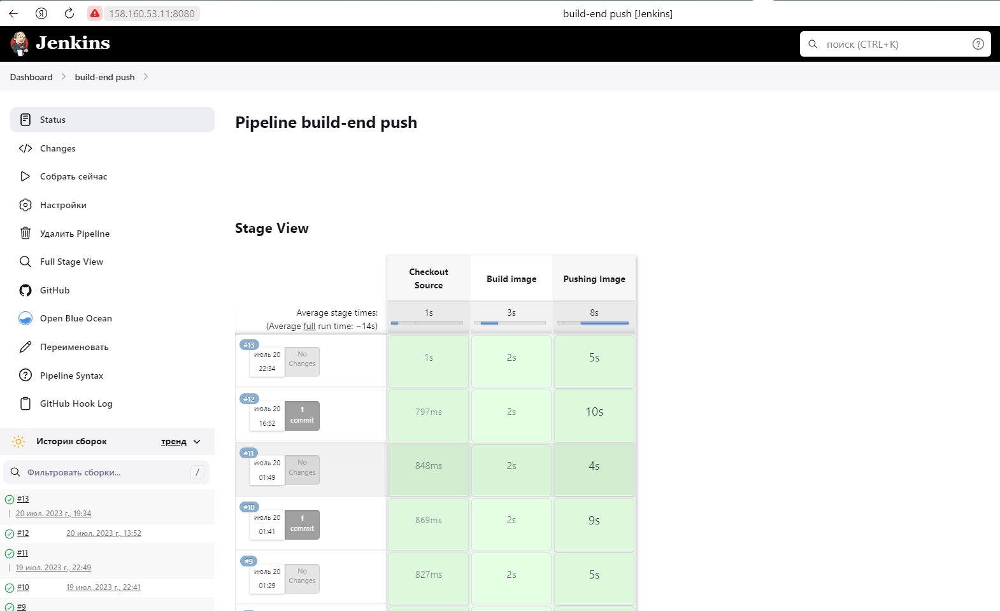

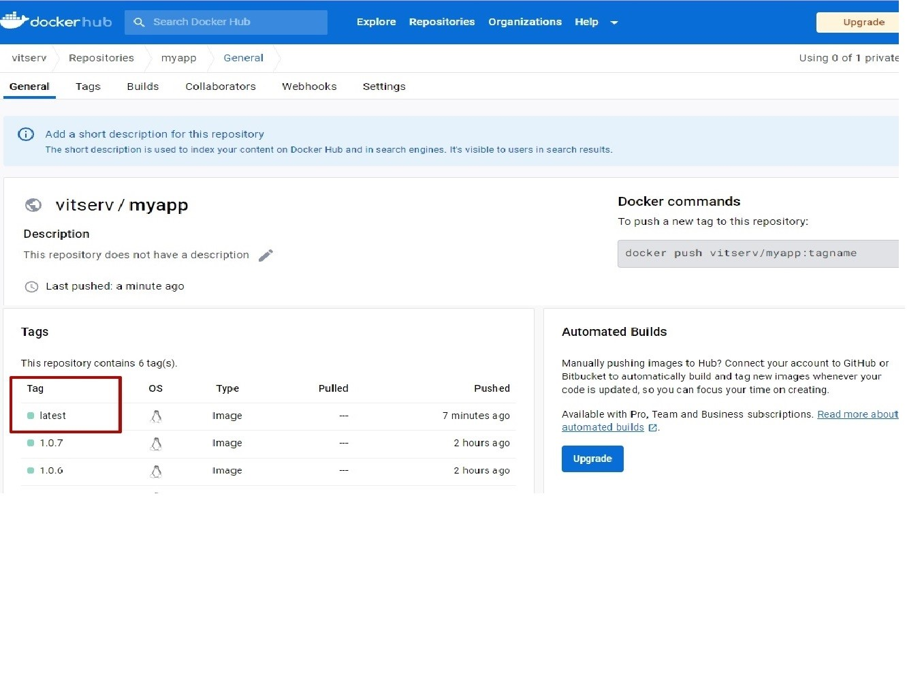

3. При создании тега (например, v1.0.0) происходит сборка и отправка с соответствующим label в регистр, а также деплой соответствующего Docker образа в кластер Kubernetes.

Создаем pipline который будет выполнять последний пункт нашего задания.
- [Jenkinsfile](jenkins/app/Jenkinsfile)

Меняем версию контент-файла в гите и отправляем в наш репозиторий.
(venv) root@server1:~/terraform/diploma/src/myapp# git push -f origin
```

Получаем:

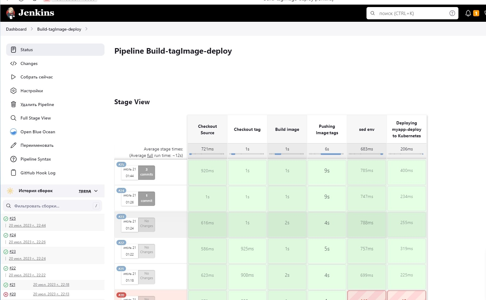

<details>
<summary>Вывод лога pipeline</summary>

```commandline

Started by GitHub push by Valdem88
[Pipeline] Start of Pipeline
[Pipeline] node
Running on Jenkins in /var/jenkins_home/workspace/Build-tagImage-deploy
[Pipeline] {
[Pipeline] withEnv
[Pipeline] {
[Pipeline] stage
[Pipeline] { (Checkout Source)
[Pipeline] git
The recommended git tool is: NONE
No credentials specified
 > git rev-parse --resolve-git-dir /var/jenkins_home/workspace/Build-tagImage-deploy/.git # timeout=10
Fetching changes from the remote Git repository
 > git config remote.origin.url https://github.com/Valdem88/myapp.git # timeout=10
Fetching upstream changes from https://github.com/Valdem88/myapp.git
 > git --version # timeout=10
 > git --version # 'git version 2.30.2'
 > git fetch --tags --force --progress -- https://github.com/Valdem88/myapp.git +refs/heads/*:refs/remotes/origin/* # timeout=10
 > git rev-parse refs/remotes/origin/main^{commit} # timeout=10
Checking out Revision eb7282e255fa0cf25b927c1e3eb37ab25817d76a (refs/remotes/origin/main)
 > git config core.sparsecheckout # timeout=10
 > git checkout -f eb7282e255fa0cf25b927c1e3eb37ab25817d76a # timeout=10
 > git branch -a -v --no-abbrev # timeout=10
 > git branch -D main # timeout=10
 > git checkout -b main eb7282e255fa0cf25b927c1e3eb37ab25817d76a # timeout=10
Commit message: "commit_all tag=1.0.9"
 > git rev-list --no-walk 4cc687968cbb0f29c0ff258fd62304bfac9ebff9 # timeout=10
[Pipeline] }
[Pipeline] // stage
[Pipeline] stage
[Pipeline] { (Checkout tag)
[Pipeline] script
[Pipeline] {
[Pipeline] sh
+ git fetch
[Pipeline] sh
+ head -n 1
+ git tag --sort=-creatordate
[Pipeline] echo
gitTag output: 1.0.9
[Pipeline] }
[Pipeline] // script
[Pipeline] }
[Pipeline] // stage
[Pipeline] stage
[Pipeline] { (Build image)
[Pipeline] script
[Pipeline] {
[Pipeline] isUnix
[Pipeline] withEnv
[Pipeline] {
[Pipeline] sh
+ docker build -t valdem88/myapp .
#0 building with "default" instance using docker driver

#1 [internal] load .dockerignore
#1 transferring context: 2B done
#1 DONE 0.1s

#2 [internal] load build definition from Dockerfile
#2 transferring dockerfile: 149B done
#2 DONE 0.1s

#3 [internal] load metadata for docker.io/library/nginx:1.23.3
#3 DONE 0.3s

#4 [1/3] FROM docker.io/library/nginx:1.23.3@sha256:f4e3b6489888647ce1834b601c6c06b9f8c03dee6e097e13ed3e28c01ea3ac8c
#4 DONE 0.0s

#5 [internal] load build context
#5 transferring context: 472B done
#5 DONE 0.0s

#6 [2/3] ADD conf /etc/nginx
#6 CACHED

#7 [3/3] ADD content /usr/share/nginx/html
#7 CACHED

#8 exporting to image
#8 exporting layers done
#8 writing image sha256:36e43758f876074349b8d85e093cba9c6a3507d72089370ecaeef04426f5d822 done
#8 naming to docker.io/valdem88/myapp done
#8 DONE 0.0s
[Pipeline] }
[Pipeline] // withEnv
[Pipeline] }
[Pipeline] // script
[Pipeline] }
[Pipeline] // stage
[Pipeline] stage
[Pipeline] { (Pushing Image:tags)
[Pipeline] withEnv
[Pipeline] {
[Pipeline] script
[Pipeline] {
[Pipeline] withEnv
[Pipeline] {
[Pipeline] withDockerRegistry
$ docker login -u valdem88 -p ******** https://index.docker.io/v1/
WARNING! Using --password via the CLI is insecure. Use --password-stdin.
WARNING! Your password will be stored unencrypted in /var/jenkins_home/workspace/Build-tagImage-deploy@tmp/8455f7f4-ab19-4474-8790-3f108d840365/config.json.
Configure a credential helper to remove this warning. See
https://docs.docker.com/engine/reference/commandline/login/#credentials-store

Login Succeeded
[Pipeline] {
[Pipeline] isUnix
[Pipeline] withEnv
[Pipeline] {
[Pipeline] sh
+ docker tag valdem88/myapp index.docker.io/valdem88/myapp:1.0.9
[Pipeline] }
[Pipeline] // withEnv
[Pipeline] isUnix
[Pipeline] withEnv
[Pipeline] {
[Pipeline] sh
+ docker push index.docker.io/valdem88/myapp:1.0.9
The push refers to repository [docker.io/valdem88/myapp]
41167bc8b5fb: Preparing
12fe6e6cfa1e: Preparing
a1bd4a5c5a79: Preparing
597a12cbab02: Preparing
8820623d95b7: Preparing
338a545766ba: Preparing
e65242c66bbe: Preparing
3af14c9a24c9: Preparing
3af14c9a24c9: Waiting
338a545766ba: Waiting
e65242c66bbe: Waiting
a1bd4a5c5a79: Layer already exists
12fe6e6cfa1e: Layer already exists
8820623d95b7: Layer already exists
597a12cbab02: Layer already exists
338a545766ba: Layer already exists
e65242c66bbe: Layer already exists
3af14c9a24c9: Layer already exists
41167bc8b5fb: Pushed
1.0.9: digest: sha256:6c7d50ee081ba2aa7370c977c8a6d5b75b804e986ba74c02cfbfc888968a44fe size: 1984
[Pipeline] }
[Pipeline] // withEnv
[Pipeline] }
[Pipeline] // withDockerRegistry
[Pipeline] }
[Pipeline] // withEnv
[Pipeline] }
[Pipeline] // script
[Pipeline] }
[Pipeline] // withEnv
[Pipeline] }
[Pipeline] // stage
[Pipeline] stage
[Pipeline] { (sed env)
[Pipeline] withEnv
[Pipeline] {
[Pipeline] script
[Pipeline] {
[Pipeline] sh
+ sed -i 18,22 s/gitTag/1.0.9/g myapp-deploy.yml
[Pipeline] sh
+ cat myapp-deploy.yml
---
apiVersion: apps/v1
kind: Deployment
metadata:
  labels:
    app: app-web
  name: app-web
  namespace: stage
spec:
  replicas: 1
  selector:
    matchLabels:
      app: app-web
  template:
    metadata:
      labels:
        app: app-web
    spec:
      containers:
        - image: valdem88/myapp:1.0.9
          imagePullPolicy: IfNotPresent
          name: app-web
      terminationGracePeriodSeconds: 30

---
apiVersion: v1
kind: Service
metadata:
  name: app-web
  namespace: stage
spec:
  ports:
    - name: web
      port: 80
      targetPort: 80
      nodePort: 30080
  selector:
    app: app-web
  type: NodePort
[Pipeline] }
[Pipeline] // script
[Pipeline] }
[Pipeline] // withEnv
[Pipeline] }
[Pipeline] // stage
[Pipeline] stage
[Pipeline] { (Deploying myapp-deploy to Kubernetes)
[Pipeline] script
[Pipeline] {
[Pipeline] kubernetesDeploy
Starting Kubernetes deployment
Loading configuration: /var/jenkins_home/workspace/Build-tagImage-deploy/myapp-deploy.yml
Applied Deployment: Deployment(apiVersion=apps/v1, kind=Deployment, metadata=ObjectMeta(annotations=null, clusterName=null, creationTimestamp=2023-07-16T21:50:29Z, deletionGracePeriodSeconds=null, deletionTimestamp=null, finalizers=[], generateName=null, generation=19, initializers=null, labels={app=app-web}, name=app-web, namespace=stage, ownerReferences=[], resourceVersion=494029, selfLink=null, uid=8d0120df-f2e3-41a5-b358-b17f49d140a0, additionalProperties={managedFields=[{manager=kube-controller-manager, operation=Update, apiVersion=apps/v1, time=2023-07-20T22:26:45Z, fieldsType=FieldsV1, fieldsV1={f:status={f:availableReplicas={}, f:conditions={.={}, k:{"type":"Available"}={.={}, f:lastTransitionTime={}, f:lastUpdateTime={}, f:message={}, f:reason={}, f:status={}, f:type={}}, k:{"type":"Progressing"}={.={}, f:lastTransitionTime={}, f:lastUpdateTime={}, f:message={}, f:reason={}, f:status={}, f:type={}}}, f:observedGeneration={}, f:readyReplicas={}, f:replicas={}, f:updatedReplicas={}}}, subresource=status}, {manager=okhttp, operation=Update, apiVersion=apps/v1, time=2023-07-20T22:44:30Z, fieldsType=FieldsV1, fieldsV1={f:metadata={f:labels={.={}, f:app={}}}, f:spec={f:progressDeadlineSeconds={}, f:replicas={}, f:revisionHistoryLimit={}, f:selector={}, f:strategy={f:rollingUpdate={.={}, f:maxSurge={}, f:maxUnavailable={}}, f:type={}}, f:template={f:metadata={f:labels={.={}, f:app={}}}, f:spec={f:containers={k:{"name":"app-web"}={.={}, f:image={}, f:imagePullPolicy={}, f:name={}, f:resources={}, f:terminationMessagePath={}, f:terminationMessagePolicy={}}}, f:dnsPolicy={}, f:restartPolicy={}, f:schedulerName={}, f:securityContext={}, f:terminationGracePeriodSeconds={}}}}}}]}), spec=DeploymentSpec(minReadySeconds=null, paused=null, progressDeadlineSeconds=600, replicas=1, revisionHistoryLimit=10, selector=LabelSelector(matchExpressions=[], matchLabels={app=app-web}, additionalProperties={}), strategy=DeploymentStrategy(rollingUpdate=RollingUpdateDeployment(maxSurge=IntOrString(IntVal=null, Kind=null, StrVal=25%, additionalProperties={}), maxUnavailable=IntOrString(IntVal=null, Kind=null, StrVal=25%, additionalProperties={}), additionalProperties={}), type=RollingUpdate, additionalProperties={}), template=PodTemplateSpec(metadata=ObjectMeta(annotations=null, clusterName=null, creationTimestamp=null, deletionGracePeriodSeconds=null, deletionTimestamp=null, finalizers=[], generateName=null, generation=null, initializers=null, labels={app=app-web}, name=null, namespace=null, ownerReferences=[], resourceVersion=null, selfLink=null, uid=null, additionalProperties={}), spec=PodSpec(activeDeadlineSeconds=null, affinity=null, automountServiceAccountToken=null, containers=[Container(args=[], command=[], env=[], envFrom=[], image=valdem88/myapp:1.0.9, imagePullPolicy=IfNotPresent, lifecycle=null, livenessProbe=null, name=app-web, ports=[], readinessProbe=null, resources=ResourceRequirements(limits=null, requests=null, additionalProperties={}), securityContext=null, stdin=null, stdinOnce=null, terminationMessagePath=/dev/termination-log, terminationMessagePolicy=File, tty=null, volumeDevices=[], volumeMounts=[], workingDir=null, additionalProperties={})], dnsConfig=null, dnsPolicy=ClusterFirst, hostAliases=[], hostIPC=null, hostNetwork=null, hostPID=null, hostname=null, imagePullSecrets=[], initContainers=[], nodeName=null, nodeSelector=null, priority=null, priorityClassName=null, restartPolicy=Always, schedulerName=default-scheduler, securityContext=PodSecurityContext(fsGroup=null, runAsNonRoot=null, runAsUser=null, seLinuxOptions=null, supplementalGroups=[], additionalProperties={}), serviceAccount=null, serviceAccountName=null, subdomain=null, terminationGracePeriodSeconds=30, tolerations=[], volumes=[], additionalProperties={}), additionalProperties={}), additionalProperties={}), status=DeploymentStatus(availableReplicas=1, collisionCount=null, conditions=[DeploymentCondition(lastTransitionTime=2023-07-20T17:56:40Z, lastUpdateTime=2023-07-20T17:56:40Z, message=Deployment has minimum availability., reason=MinimumReplicasAvailable, status=True, type=Available, additionalProperties={}), DeploymentCondition(lastTransitionTime=2023-07-20T22:18:37Z, lastUpdateTime=2023-07-20T22:24:20Z, message=ReplicaSet "app-web-68c4f7b55c" has successfully progressed., reason=NewReplicaSetAvailable, status=True, type=Progressing, additionalProperties={})], observedGeneration=18, readyReplicas=1, replicas=1, unavailableReplicas=null, updatedReplicas=1, additionalProperties={}), additionalProperties={})
Applied Service: Service(apiVersion=v1, kind=Service, metadata=ObjectMeta(annotations=null, clusterName=null, creationTimestamp=2023-07-16T21:50:30Z, deletionGracePeriodSeconds=null, deletionTimestamp=null, finalizers=[], generateName=null, generation=null, initializers=null, labels=null, name=app-web, namespace=stage, ownerReferences=[], resourceVersion=461278, selfLink=null, uid=359254a8-3a41-41e0-85df-d3aea0452d66, additionalProperties={managedFields=[{manager=okhttp, operation=Update, apiVersion=v1, time=2023-07-16T21:50:30Z, fieldsType=FieldsV1, fieldsV1={f:spec={f:externalTrafficPolicy={}, f:internalTrafficPolicy={}, f:ports={.={}, k:{"port":80,"protocol":"TCP"}={.={}, f:name={}, f:nodePort={}, f:port={}, f:protocol={}, f:targetPort={}}}, f:selector={}, f:sessionAffinity={}, f:type={}}}}]}), spec=ServiceSpec(clusterIP=10.233.35.199, externalIPs=[], externalName=null, externalTrafficPolicy=Cluster, healthCheckNodePort=null, loadBalancerIP=null, loadBalancerSourceRanges=[], ports=[ServicePort(name=web, nodePort=30080, port=80, protocol=TCP, targetPort=IntOrString(IntVal=80, Kind=null, StrVal=null, additionalProperties={}), additionalProperties={})], publishNotReadyAddresses=null, selector={app=app-web}, sessionAffinity=None, sessionAffinityConfig=null, type=NodePort, additionalProperties={clusterIPs=[10.233.35.199], ipFamilies=[IPv4], ipFamilyPolicy=SingleStack, internalTrafficPolicy=Cluster}), status=ServiceStatus(loadBalancer=LoadBalancerStatus(ingress=[], additionalProperties={}), additionalProperties={}), additionalProperties={})
Finished Kubernetes deployment
[Pipeline] }
[Pipeline] // script
[Pipeline] }
[Pipeline] // stage
[Pipeline] }
[Pipeline] // withEnv
[Pipeline] }
[Pipeline] // node
[Pipeline] End of Pipeline
Finished: SUCCESS
```
</details>

- log web-hooks

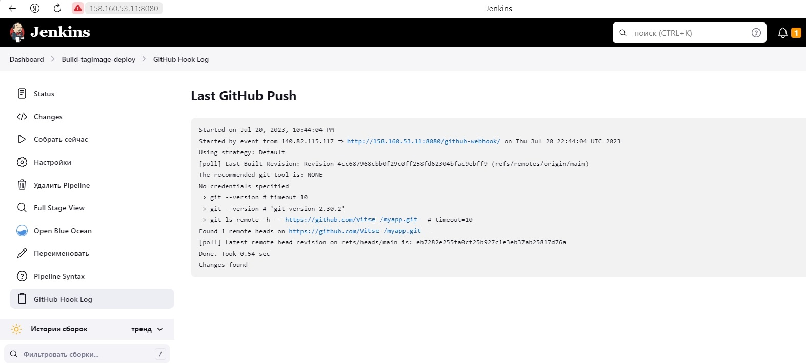

- image созданный в процессе 


- pod на нашем кластере kubernetes

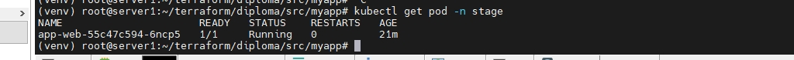

- web доступ к запущенному приложению с отметкой номера тега(для наглядности).

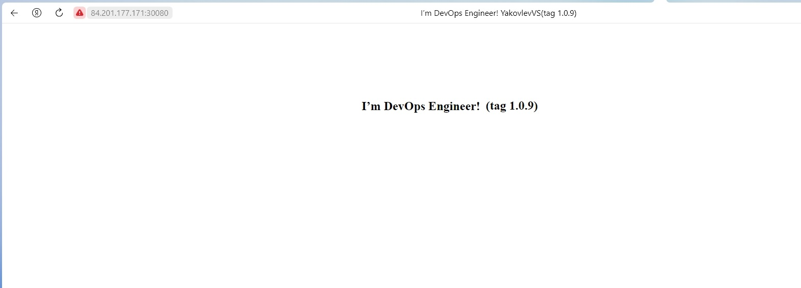

Выполняем сборку еще раз теперь уже используя Blue Ocean

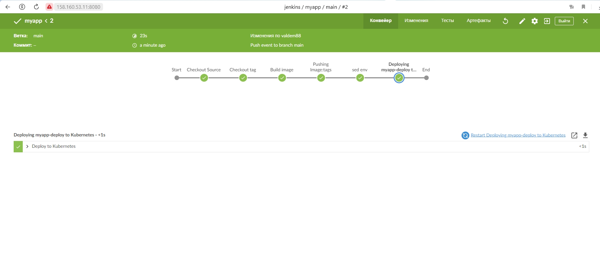

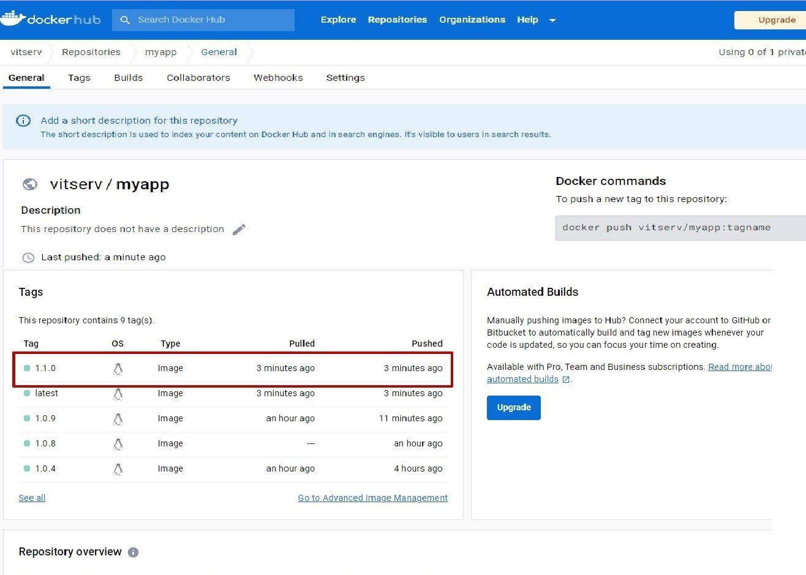

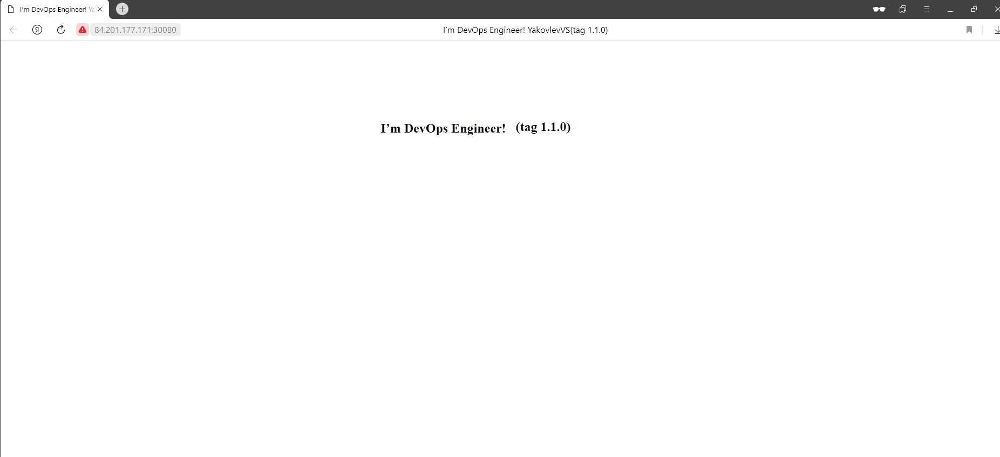

---
## Что необходимо для сдачи задания?

1. Репозиторий с конфигурационными файлами Terraform и готовность продемонстрировать создание всех ресурсов с нуля.
2. Пример pull request с комментариями созданными atlantis'ом или снимки экрана из Terraform Cloud.
3. Репозиторий с конфигурацией ansible, если был выбран способ создания Kubernetes кластера при помощи ansible.
4. Репозиторий с Dockerfile тестового приложения и ссылка на собранный docker image.
5. Репозиторий с конфигурацией Kubernetes кластера.
6. Ссылка на тестовое приложение и веб интерфейс Grafana с данными доступа.
7. Все репозитории рекомендуется хранить на одном ресурсе (github, gitlab)

---
## Как правильно задавать вопросы дипломному руководителю?

Что поможет решить большинство частых проблем:

1. Попробовать найти ответ сначала самостоятельно в интернете или в 
  материалах курса и ДЗ и только после этого спрашивать у дипломного 
  руководителя. Навык поиска ответов пригодится вам в профессиональной 
  деятельности.
2. Если вопросов больше одного, присылайте их в виде нумерованного 
  списка. Так дипломному руководителю будет проще отвечать на каждый из 
  них.
3. При необходимости прикрепите к вопросу скриншоты и стрелочкой 
  покажите, где не получается.

Что может стать источником проблем:

1. Вопросы вида «Ничего не работает. Не запускается. Всё сломалось». 
  Дипломный руководитель не сможет ответить на такой вопрос без 
  дополнительных уточнений. Цените своё время и время других.
2. Откладывание выполнения курсового проекта на последний момент.
3. Ожидание моментального ответа на свой вопрос. Дипломные руководители - практикующие специалисты, которые занимаются, кроме преподавания, 
  своими проектами. Их время ограничено, поэтому постарайтесь задавать правильные вопросы, чтобы получать быстрые ответы :)
